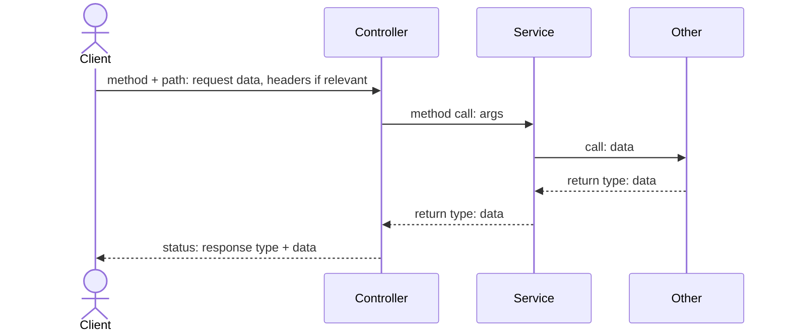
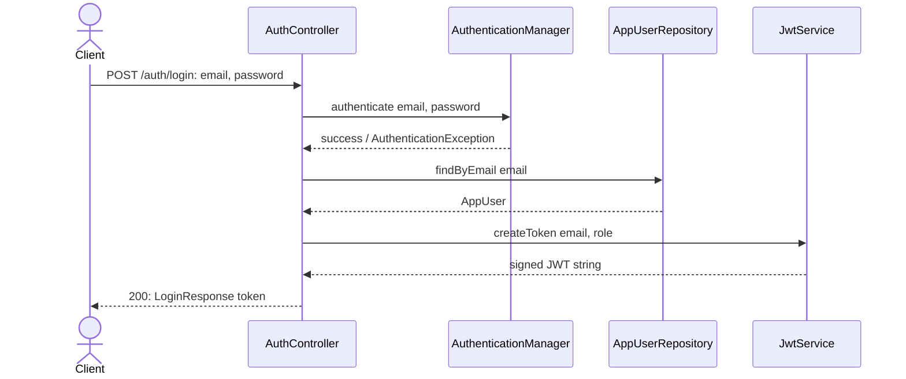

---

## name: vertical-slice-plans
description: Structure backend implementation plans so a human can implement them by hand, split into small vertical slices (one functionality per slice) with a mermaid sequence diagram per request path. Use when writing an implementation plan, design doc, RFC, or task breakdown for a backend feature, API endpoint, or service change.

# Vertical Slice Plans

## Core idea

A plan here is read and typed by a human, not applied as a patch. Optimize every choice for that reader:

- **One functionality per file.** A vertical slice is one request path, end-to-end (route → handler → service → external system/DB → response). Never bundle two independent functionalities into one slice, even if they share a resource or root path. Err toward more, smaller slices — granularity is what makes each slice teach the reader what they're doing.
- **Full file content, not diffs.** A diff hunk forces the reader to mentally merge it into the current file. A full file body is copy-paste-done, and it's unambiguous.
- **Data flow is explicit, not implied.** Every slice gets its own sequence diagram tracing the request end-to-end, with arrows labeled by the data crossing them, not just component names.
- **Each slice is self-contained.** A reader must be able to implement and verify slice N without having read slice N+1.


## Workflow

1. **Identify the functionalities.** List every independently-describable capability in the ask (e.g. "log in", "change password", "list accounts", "dashboard summary"). Each becomes one slice, even if two slices touch the same resource.
2. **Decide if you need an epic.**
  - One functionality → skip the epic, write a single slice doc directly (see [templates/slice-template.md](templates/slice-template.md)).
  - More than one → write an epic overview first (see [templates/epic-template.md](templates/epic-template.md)), then one slice doc per functionality.
  - Slices splitting into independent clusters → don't nest, create separate epics (see "When one epic becomes several" below) before writing any slice docs.
3. **Order the slices by dependency, not by layer.** A slice whose data other slices need (e.g. "authenticate" before "change my password") comes first. Record *why*, not just the order.
4. **Write the epic doc** (if any): problem statement, domain glossary, one system-wide data-flow diagram, ordered slice list with a one-line dependency reason each.
5. **Write each slice doc**, in dependency order, following the slice template. Scope each diagram to ONLY that slice's path — resist redrawing the whole system.
6. **Name files so directory order matches implementation order**:
  ```
   plans/<epic-slug>/00-overview.md
   plans/<epic-slug>/01-<slice-slug>.md
   plans/<epic-slug>/02-<slice-slug>.md
  ```
   A single-functionality ask skips the subfolder: `plans/<slice-slug>.md`.


## Data-flow diagram rules

Use a mermaid `sequenceDiagram` in every slice doc. Top-to-bottom is execution order. Shape it **client ↔ controller ↔ service/repo → other component**, with a call/return pair at each boundary (`->>` for the call, `-->>` for the return):




Real example — logging in with email + password:




The epic overview's system diagram stays a mermaid `flowchart`: it is a map of shared components across slices, not one request path.

Rules that keep this at the right abstraction level:

- **Stop at direct calls.** Only show components the code being written actually calls. Don't descend into a library/framework's own internals (e.g. what `AuthenticationManager` does inside itself) unless that internal behavior is what this slice is implementing or changing.
- **Label arrows with real data**, not generic words like "request"/"response" — the HTTP method + path or the method name for calls, the type name (and key fields) for what comes back.
- **Include headers on the client arrow when relevant** (e.g. `Authorization: Bearer <token>`) — the reader needs to know what the client must send, not just the body.
- **Siblings, not always a chain.** A controller calling four collaborators in sequence is four call/return pairs from that participant, listed top to bottom — not a forced chain through all four.
- **One diagram, one functionality.** If the flow doesn't fit without an "and" (two unrelated paths, or a branch that doesn't rejoin), it's two slices — split it.


## Slice doc sections

(Full skeleton in [templates/slice-template.md](templates/slice-template.md).)

1. **What it does** — one sentence, user-facing, not implementation detail.
2. **Why** — the reasoning behind this shape, tied to constraints already in the code or the domain. Not filler ("this improves maintainability").
3. **Data flow** — the scoped mermaid `sequenceDiagram`, arrows labeled with data.
4. **Today → after** (only if modifying existing code) — cite exact files/lines for what exists now, so the reader knows what they're replacing before they see the new content.
5. **Exact changes** — full file content per touched file, ordered so nothing references code that doesn't exist yet (DTOs/records → repositories/clients → services → controllers). Each file is its own `- [ ]` checkbox, unchecked by default — see "Implementing a slice" below for what checking a box means.
6. **Verify** — concrete, runnable steps: a command to run, a request to send, the exact expected output. Never "add tests" or "make sure it works" as the whole instruction.
7. **Out of scope** — adjacent things this slice deliberately does not do, so the reader doesn't scope-creep while implementing.


## Implementing a slice

Plans here are meant to be worked partly by hand and partly by the agent — the human may check off and implement some changes manually, then hand the rest to the agent. When asked to implement a slice doc, for each `- [ ]` change in it, in order:

1. **Check reality before writing anything.** Read the target file as it exists now. Don't trust the checkbox state alone — a human may have implemented a change without checking its box, or checked a box optimistically before finishing.
2. **Already implemented and matches the plan** → check the box (if not already checked), don't rewrite the file, and say so briefly.
3. **Already implemented but better than the plan** (e.g. it fixes an edge case the plan missed) → check the box, and tell the user what differs and why it's fine. Do not overwrite the improvement with the plan's original text.
4. **Already implemented but wrong** (bug, wrong shape, misses the "why" from the slice doc) → explain the gap concretely against the slice's own "Why" and "Data flow" sections, propose the fix, and only check the box once it's corrected. Don't silently replace the user's code without saying what was wrong.
5. **Not implemented** → implement exactly as specified, then check the box.
6. Never check a box on intent alone — only after the file content has actually been verified to satisfy that change.


## When one epic becomes several (split, don't nest)

Never nest epics. If an epic feels like it needs sub-grouping, that's a sign it's actually two or more epics — split flat and give each its own overview doc.

**Signals it's time to split:**

- The slices form clusters that wouldn't appear in the same drawing — you'd need two disconnected subgraphs for the system data-flow diagram, because one cluster's slices never touch the other cluster's shared components.
- Two clusters need non-overlapping domain glossaries — a term from one cluster's slice docs never appears in the other's.
- Each cluster has its own standalone "why now" — it would still be worth building even if the other cluster didn't exist.
- The slice list keeps growing as you decompose further, and new slices keep sorting into the same 2-3 buckets instead of spreading evenly across the whole epic.

**If none of these hold** — the slices share components, share vocabulary, and only make sense together because of one problem statement — keep it as one epic, no matter how many slices it has. Example: `plans/treasury-dashboard-api.md`'s slices (login enrichment, `/me`, password change, home settings, treasury accounts/transactions/dashboard) all exist only because "the SPA needs one stable API," and all funnel through the same membership/DB lookup. One epic, six-plus slices, no split needed.

**Naming split epics:** name each by the capability/data path its slices share — a noun phrase specific enough that a stranger could guess its slices from the name alone. Avoid umbrella terms ("User management") that just relabel "everything in this domain."

Worked example — a "User management" epic that hits the signals above splits into:

- **Authentication** — login, token issuance, session-adjacent slices. Shared component: credential verification + JWT.
- **Account Self-Service** — change password, update profile, delete own account. Shared trait: the actor is always "the current user," no cross-user access.
- **Membership Administration** — invite a member, change a member's role, remove a member. Shared trait: acting on *another* user, requires an authorization check the self-service slices don't need.

Each gets its own `00-overview.md`, problem statement, domain glossary, and slice list — instead of one epic with mixed vocabulary and a diagram nobody can read.

## Epic doc sections

(Full skeleton in [templates/epic-template.md](templates/epic-template.md).)

1. **Problem** — plain-language statement of what's being built and why now.
2. **Domain terms** — shared vocabulary every slice must use consistently (same noun for the same concept across all slice docs).
3. **System data flow** — one mermaid `flowchart` showing all slices' entry points into shared components (DB, external APIs, shared services). A map across slices, not a request path.
4. **Slices** — ordered list; each entry is a one-line description plus the dependency reason for its position, and becomes a link once its file exists.


## Anti-patterns

- Nesting epics instead of splitting them flat when slices form independent clusters.
- Grouping by architecture layer ("all controllers", then "all services") — that's horizontal, not vertical.
- One diagram covering more than one functionality.
- Diffs/hunks instead of full file bodies.
- A slice that requires reading another slice's changes to implement or verify.
- Vague verification steps instead of a concrete command plus expected output.
- Padding "why" with generic justification instead of the actual constraint driving the decision.
- Checking a change's box, or rewriting its file, without first reading what's actually there.

