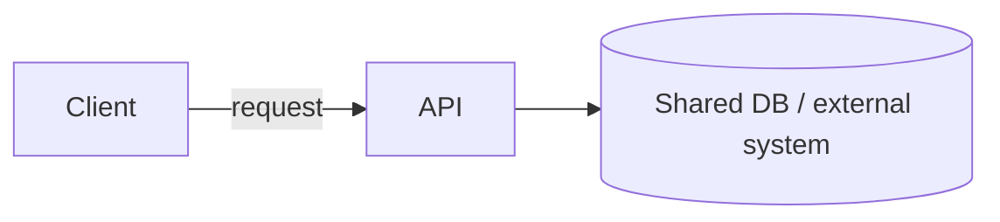

# [Epic name]

## Problem

[Plain-language: what exists today, what's missing, why this is being built now. 2-4 sentences. No jargon that isn't defined in Domain terms below.]

## Domain terms

Use these words, and only these words, for these concepts across every slice doc.

- **[Term]**: [definition, one sentence]. [Note anything it is NOT, if the name is easily confused, e.g. "not a bank account".]
- **[Term]**: [definition]
- **[Term]**: [definition]

## System data flow

One mermaid `flowchart` showing every slice's entry point and how they share components (DB, external APIs, shared services). This is a map across slices, not a request path — leave `sequenceDiagram` for the slice docs. Label edges with data, not actions.

## Slices

Ordered by dependency — earlier slices produce data or capabilities later slices need. State the reason, not just the number.

1. **[Slice 1 name]** — [one-line description]. First because [reason, e.g. "every other slice needs an authenticated request"].
2. **[Slice 2 name]** — [one-line description]. Needs slice 1's [specific thing, e.g. "JWT claim shape"].
3. **[Slice 3 name]** — [one-line description]. Independent of 1/2 but ordered here because [reason].

## Out of scope (epic-wide)

- [Things explicitly deferred for the whole epic, not just one slice — e.g. "public signup", "notification channels".]

