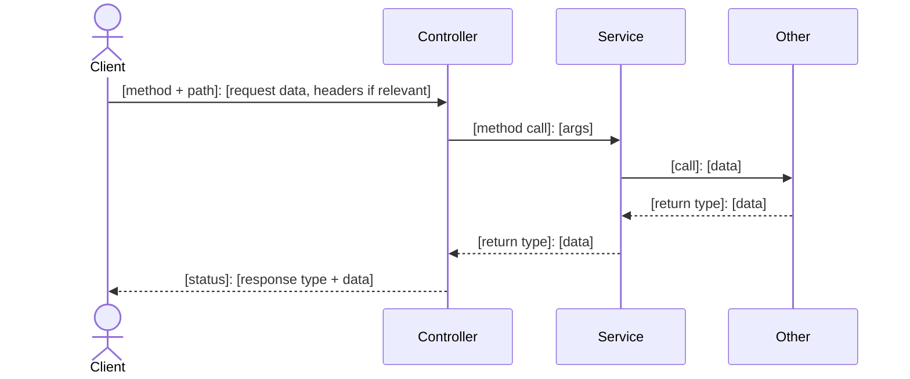
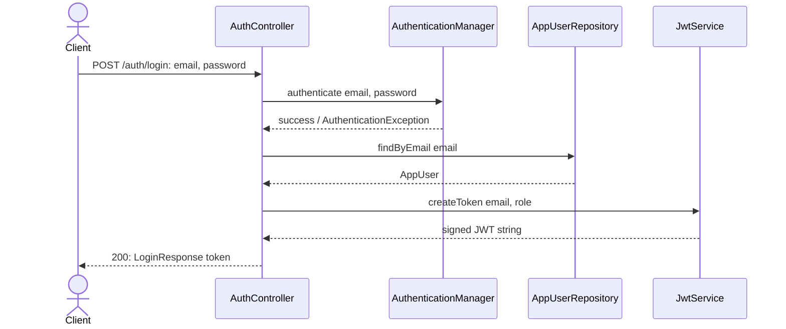

# [Slice name]

## What it does

[One sentence, user-facing. E.g. "Lets the current user change their password." Not "Adds a PUT endpoint."]

## Why

[The reasoning behind this shape, tied to an actual constraint in the code or domain. Reference specific files/decisions if relevant. Cut anything that would still be true if you deleted this section and replaced it with "because it's good practice" — that means it's filler.]

## Data flow

Scoped to ONLY this slice, shaped **client ↔ controller ↔ service/repo → other component**, with a call/return pair at each boundary. Use mermaid `sequenceDiagram` — top-to-bottom is execution order. Label arrows with real data (method + path, method name, type names), not generic words like "request"/"response". Stop at what the code being written directly calls — don't descend into a library/framework's own internals unless this slice is implementing or changing that internal behavior. Include headers on the client arrow when relevant (e.g. `Authorization: Bearer <token>`).



<details>
<summary>Worked example: "log in with email + password"</summary>

`AuthController` calls four collaborators in sequence — they're siblings off the controller, listed top to bottom, not a forced chain through all four. Nothing inside `AuthenticationManager` (its own `AppUserDetailsService`/`PasswordEncoder` lookups) is shown, because this slice doesn't implement or change that — it's Spring's internal machinery, not something the reader builds or calls.



</details>

## Today → after

[Only include this section if modifying existing code. Skip entirely for new functionality.]

**Today** in [File.java](path/to/File.java): [what exists now, cited precisely — method names, current request/response shape, line-level detail if it matters].

**After:** [what changes, in prose, before the code below spells it out].

## Exact changes

List files in the order a human should create/edit them — nothing below should reference a type or method that doesn't exist yet at that point in the list.

Each change is its own checkbox. Leave it unchecked until the file actually matches what's shown — check it off only after implementing (or verifying an existing manual implementation of) that exact change.

- [ ] **New** [FileName.java](path/to/FileName.java) — [one line: what this file is for, if not obvious from its name]

  ```java
  // full file content, not a diff
  ```

- [ ] **Edit** [NextFile.java](path/to/NextFile.java) — [one line: what's changing and why]

  ```java
  // full file content
  ```

## Verify

Concrete, runnable steps. Replace with the real commands/requests for this slice.

1. Run: `[command]`
2. Send: `[curl/http request with real example values]`
3. Expect: `[exact response body or status code]`
4. [Any edge case worth checking, e.g. "send with a wrong password → expect 401"]

## Out of scope

- [Adjacent thing this slice deliberately does not cover, e.g. "does not invalidate existing tokens"]
- [Another]
